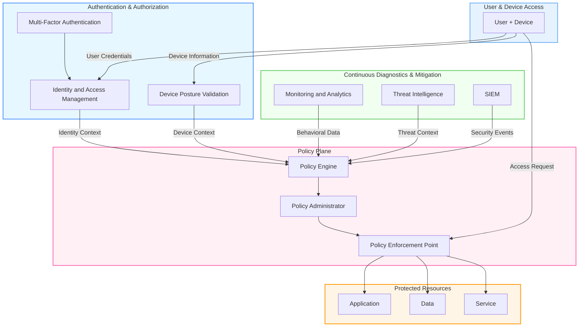

<!-- BADGES:START -->

<!-- BADGES:END -->

  

# 🔐 Zero Trust Network — Comprehensive Course

> **Teaching-first, hands-on curriculum** guiding learners from foundational Zero Trust principles to enterprise-grade implementations across cloud and hybrid environments.

---

## 🧭 Overview

This repository is your **complete learning and lab environment** for mastering the **Zero Trust security model — “Never trust, always verify.”**  
It blends **visual analogies**, **interactive hands-on labs**, and **real-world architecture diagrams** to prepare you for roles like:

- 🛡️ Cloud Security Architect  
- ☁️ Zero Trust Engineer  
- 🧰 DevSecOps & Identity Governance Specialist  

---

## 🧩 Course Highlights

| Module | Focus Area | Hands-On Labs |
|:--|:--|:--|

| Module | Focus Area | Hands-On Labs |
|:--|:--|:--|
| [📘 01 – Executive Summary](docs/01-executive-summary.md) | Course overview and learning objectives | Course orientation |
| [👥 02 – HR & Hiring Guide](docs/02-hr-hiring-guide.md) | Team building and career preparation | Role planning exercises |
| [🔰 03 – Beginner's Foundation](docs/03-beginners-foundation.md) | Core concepts and NIST 800-207 framework | Policy model visualization |
| [🎯 04 – Core Concepts Deep Dive](docs/04-core-concepts-deepdive.md) | Policy engine, enforcement points, and telemetry | ZTA policy deployment |
| [☁️ 05 – Multi-Cloud Implementation](docs/05-multi-cloud-implementation.md) | AWS, Azure, GCP Zero Trust patterns | Multi-cloud labs |
| [📊 06 – Case Study & Analysis](docs/06-case-study-failure-analysis.md) | Real-world implementations and lessons | Incident response scenarios |
| [🚀 07 – Advanced Patterns](docs/07-advanced-patterns.md) | Enterprise-scale Zero Trust architecture | Advanced policy design |
| [🧠 Threat Modeling Lab](docs/models/01-threat-model.md) | Identify protect surfaces and adversaries | OPA access control policy demo |
---

## 🧠 What You’ll Learn

✅ Understand Zero Trust principles from **theory and practice**  
✅ Design **least-privilege access** across networks and identities  
✅ Build **automated security policies** with AWS CLI, Terraform, and GitHub Actions  
✅ Implement **visibility and telemetry pipelines**  
✅ Architect **multi-cloud Zero Trust topologies** end-to-end  

---

## 📊 Zero Trust Architecture (Interactive Diagram)
 

    
🧩 Repository Structure
bash
Copy code
📦 zero-trust-comprehensive-course/
 ┣ 📁 docs/                     # Course modules & theory
 ┣ 📁 labs/                     # CLI & Terraform hands-on
 ┣ 📁 diagrams/                 # Mermaid & architecture visuals
 ┣ 📁 scripts/                  # Automation scripts
 ┣ 📄 README.md                 # This file
 ┗ 📄 LICENSE
⚙️ How to Start
Clone this repo:

bash
Copy code
git clone https://github.com/Olagoldstx/zero-trust-comprehensive-course.git
cd zero-trust-comprehensive-course
Open the foundational module:
👉 docs/03-beginners-foundation.md

Follow along with labs and checkpoints in sequence.

🌟 Contributing
We welcome PRs and new lab ideas!

Create a new branch (feat/module-update)

Add your contribution under /docs or /labs

Submit a pull request for review

🗂 Example PR Titles:

feat: add Zero Trust NetworkPolicy Lab

fix: update IAM diagram link

📚 References & Further Reading
NIST SP 800-207 – Zero Trust Architecture

Microsoft Zero Trust Guidance

AWS Zero Trust Workshop

Google BeyondCorp Overview

💬 Credits
Built with 💡 by Olagoldstx and the Zero Trust Network EX initiative.
Each module combines deep reasoning, hands-on labs, and visual-first learning.

“Security is not a product — it’s an architecture of continuous verification.”

🧭 Quick Navigation
Section	Link
🔰 Start Foundation	docs/03-beginners-foundation.md
🧩 View All Modules	docs/
🧱 Labs Folder	labs/
🖼 Diagrams	diagrams/
⚙️ GitHub Actions	.github/workflows/
📚 Resources	docs/99-references.md

